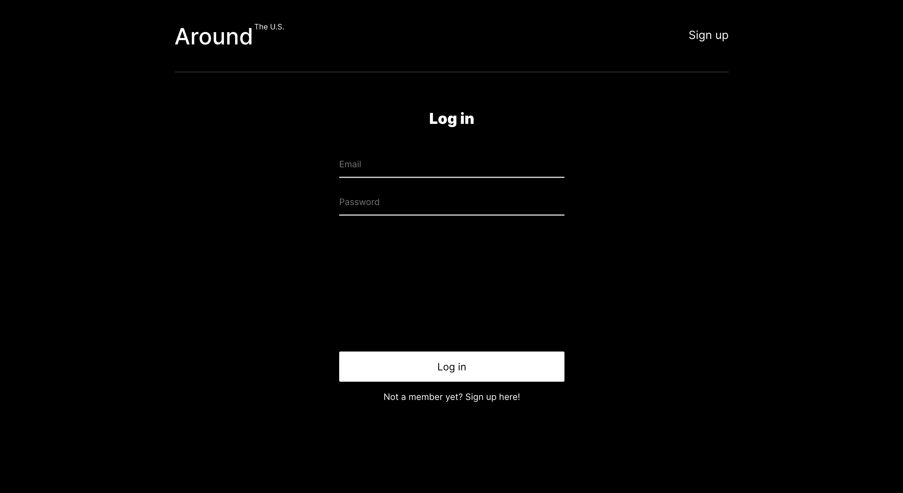
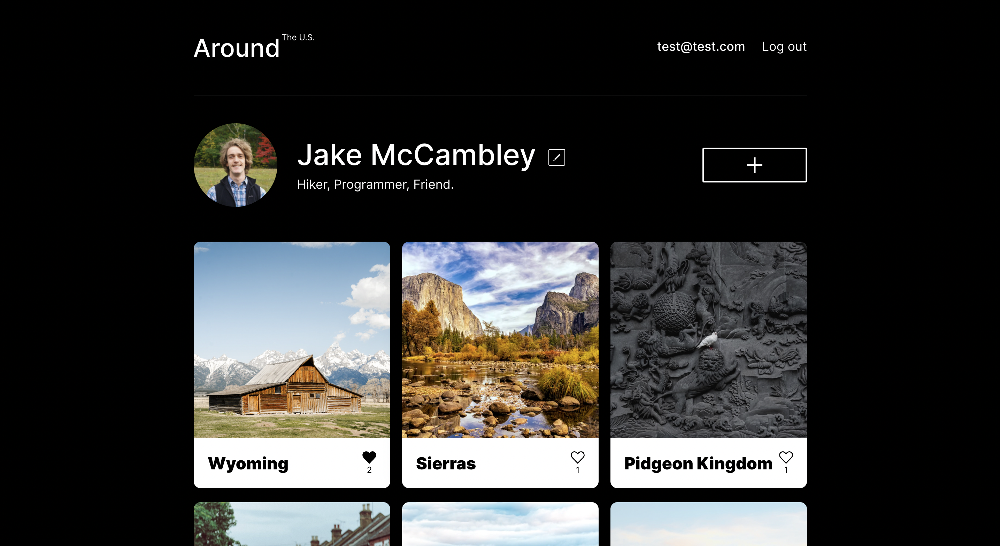
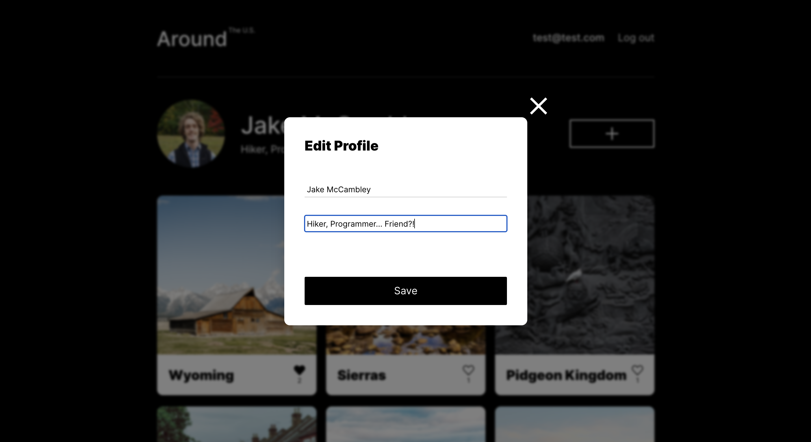
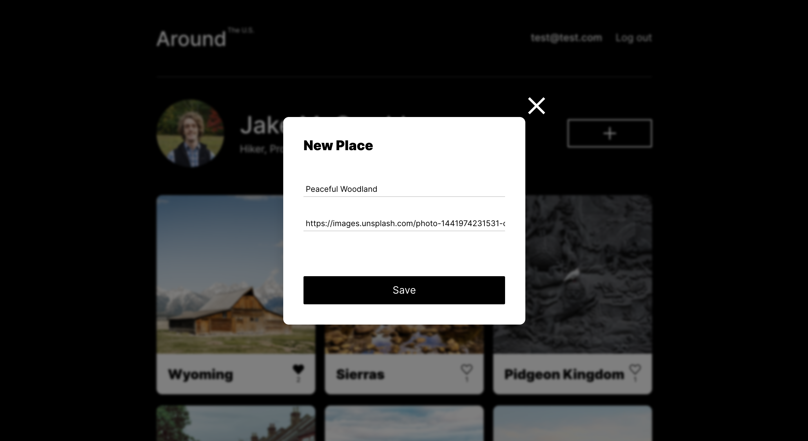
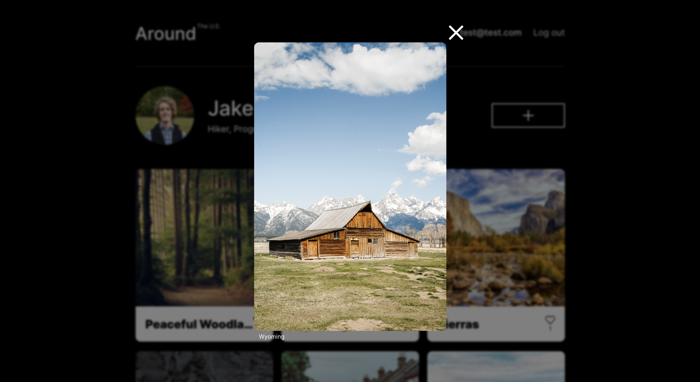

# [Around the U.S.](https://mccambley.github.io/react-around-api-full/)

This repository contains:

- The **[backend API](https://github.com/McCambley/react-around-api-full/tree/main/backend)** of "Around the U.S." with authorization and registration handled by the back-end server.
- The **[frontend](https://github.com/McCambley/react-around-api-full/tree/main/frontend)** React Application which uses this API

## 📣 Overview

- Register or login to create an account and post photo from your favorite sources
- Like photos posted from other users
- Customize your profile avatar and information
- Delete photos of yours that you no longer wish to see

## 🛠 Technologies

- **Stack**: MongoDB, Express.js, React, and Node.js
- **Google Cloud** hosts the backend
- **Mongoose** wraps MongoDB and manages data with a REST Api
- **JWT's** secure the authentication process

## ✨ Demo

---

### Register



### Main Page



### Update Profile



### Add Place



### Preview Image



---

## 🧑‍💻 Get Started

**Clone**

```
$ git clone https://github.com/McCambley/react-around-api-full.git
```

**Install**

```
$ cd react-around-api-full
$ cd frontend
$ npm i
$ cd ..
$ cd backend
$ npm i
```

**Launch**

```
$ cd backend
$ npm run dev
$ cd ..
$ cd frontend
$ npm run start
```

---

## [View the project live here! 🎉](https://mccambley.github.io/react-around-api-full/)
